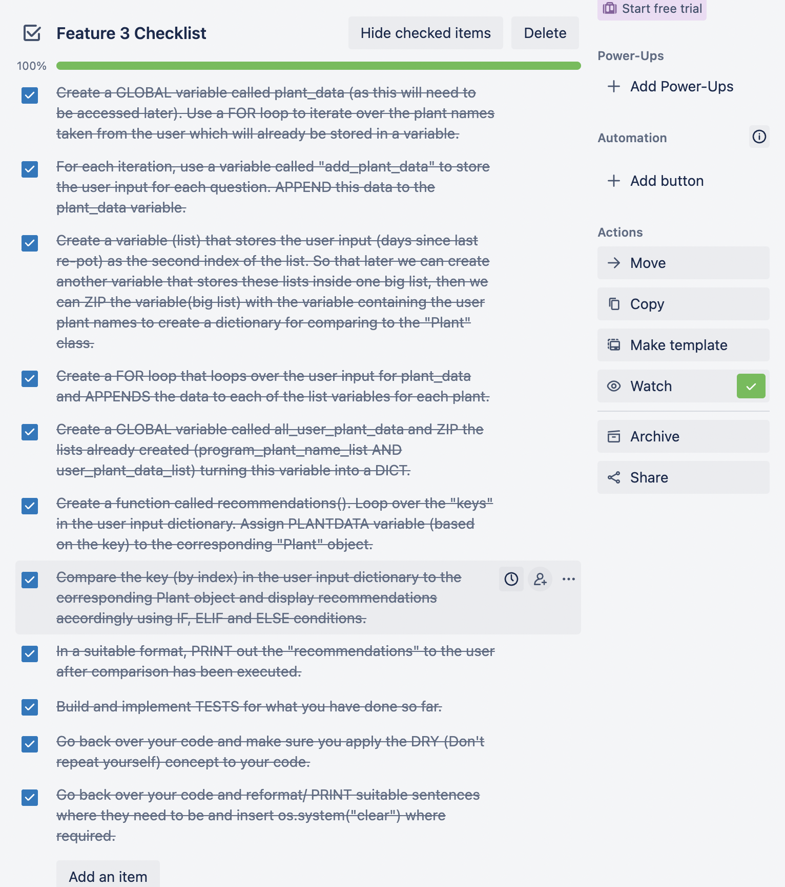

# **PlantApp.**

## [GitHub Repo](https://github.com/jordanaston/T1A3-terminal-application)

## [Source Control](https://github.com/jordanaston/T1A3-terminal-application/commits/main)

## [Trello Board](https://trello.com/b/DqOqT1Yt/t1a3-terminal-application)

## [Presentation](youtube.com)

<br>

## **Application Purpose**
PlantApp is a terminal application built in Python. It's intent is to assist users with some basic care-taking of their indoor house-plants. At the time of creation, the app supports 15 varieties of popular indoor house-plants. During use of the app, the user will create a 'collection' of their own plants with the ability to add or remove them as the please. Stored inside the app (as the Plant class) is data related to each of the supported plants. The data includes how often you should water and re-pot each plant and the appropriate location the plant should be kept to ensure the right amount of sunlight. The app will ask the user when they last watered and re-pot each plant in their collection. It will also ask if each of their plants is kept near a window or not. Based on the information submitted by the user, the app will generate helpful recommendations by comparing the user data to the data stored by the app. 

The purpose of building this app is to demonstrate my ability to design, implement and test a terminal application in Python, and throughout the process, demonstrate that I am able to use a range of developer tools. The brief for this assignment is to accept user input in the form of a file or text input and produce printed output or interact with the file system. 

Caveat: For the purpose of this assignment, information regarding water frequency, re-pot frequency and location may not be exactly accurate. For example, the references suggest that you should re-pot a snake plant every 5 to 10 years. So for this particular example, 7 years is used as the re-pot frequency for snake plant.

<br>

## **Features** 

### Feature 1
Feature one of the application shows the user a list of plants the app currently supports and then asks the user to add the first plant to their collection after pressing 'A'. During the process the app utilizes the Pretty Table module to display the users collection back to them in a nice table structure. It then asks the user to input details relating to each of their plants, it will first ask 'how many days since you last watered your plant?' for each plant in the collection. It then asks 'how many days since you last re-potted your plant?' for each plant in the collection. Finally it asks if each of those plants are kept in a location near a window or not near a window, and the user has to answer as 'Y' or 'N'. Throughout this feature, the user is met with a list of instructions. Enter 'A' to add a plant to the collection, Enter 'R' to remove a plant from the collection and Enter 'F' to finalize the plant collection. If the user enters 'A', they are met with the same list from before to chose from when adding a plant. If the user enters 'R' the user is met with more options: Select '0' to remove a plant from position one, Select '1' to remove a plant from position two, Select '2' to remove and plant from position '3' and so on.. Once the user is happy with their list, they can select 'F' to finalize their collection. The app shows them a finalized collection of their plants with Pretty Table and moves on to the next part of the app. 

### Feature 2
Feature two of the application starts by showing the user their current plant collection in Pretty Table. It then says 'Tell me a little bit more about plant 'X' (which will be the first plant in the users collection), and asks the question, 'How many days since you last WATERED plant 'X'?. The user hopefully enters an integer (but the program will catch the error with a try and except block 'Value Error' if not). If there are any more plants in the list, the app will ask the same question for the other plants and stores these values in a dictionary to use later. If there are 0 plants in the list (which can only happen if the user removes them all) the app will continue with a collection of 0. 

### Feature 3
Feature three of the application starts by showing the user their current plant collection in Pretty Table again. It then says 'Tell me a little bit more about plant 'X' (which will be the first plant in the users collection), and asks the question, 'How many days since you last RE-POTTED plant 'X'?. The user hopefully enters an integer (but the program will catch the error with a try and except block 'Value Error' if not). If there are any more plants in the list, the app will ask the same question for the other plants and appends these values to the appropriate KEY inside the dictionary to use later.  

### Feature 4
Feature four of the application starts by showing the user their current plant collection in Pretty Table once again. It then says 'Tell me a little bit more about plant 'X' (which will be the first plant in the users collection), and asks the question, ''Y' or 'N', do you keep plant 'X' near a window?. The user hopefully enters either 'Y' or 'N' (but the program will catch the error with an IF/ ELSE condition if not). If there are any more plants in the list, the app will ask the same question for the other plants and appends these values to the appropriate KEY inside the dictionary to use later. 

### Features 2, 3 and 4
Once the user has succesuflly added all the 'plant data' (watering, re-potting and location) for each plant in their collection, the app thanks the user for the data and requests the user press 'Enter' to move forward. Once the user selects 'Enter', Pretty Table shows the users collection one last time and throws a message to say 'Based on the details you have submitted, here is some handy information!'. Laid out neatly underneath a header that shows the name of each of the plants in the users collection, a recommendation is displayed for each of the questions the app initally asked. By comparing the user data for watering, re-potting and location from the dictionary to the Plant class, the app will suggest the following:

- If the number of days since the user last watered or re-pot plant 'X' is GREATER than the number of days you should wait to water or re-pot (according to the Plant class) then a message displays to say 'You're overdue on watering/ re-potting your plant by X days!'. 
- If the number of days since the user last watered or re-pot plant 'X' is LESS than the number of days you should wait to water or re-pot (according to the Plant class) then a message displays to say 'No need to stress!, you have X days to water / re-pot your plant!
- If the number of days since the user last watered or re-pot plant 'X' is EQUAL to the number of days you should wait to water or re-pot (according to the Plant class) then a message displays to say 'Today's the day to water / re-pot your plant!

The same concept is applied to the location of the plant (near window / not near window) but this time a boolen is stored in the dictionary. Whether or not the plant 'should' be kept near a window vs if it IS kept near a window, the appropriate message is displayed with a little message about the amount of sunlight each plant requires. 
<br><br>

## **Code Style-Guide and Styling Conventions**

The chosen style-guide that this application aims to follow is PEP8. 

[PEP 8 – Style Guide for Python Code](https://peps.python.org/pep-0008/)

Authors:
Guido van Rossum, Barry Warsaw, Nick Coghlan 

<br>

## **Implementation Plan**

To assist with the planning and implementation of this application, I decided to use a Trello Board to keep track of the individual tasks required to build out each feature. The tasks are prioritized in a checklist within a card for each of the 4 features. Each card includes a due date, colour labels for the type of information included in the checklist and an outline of how each feature will be implemented.

Because the trello board was created long before refactoring the code down with DRY concepts, it should be noted that all planning from the trello board was implemented in the code then changed later during re-factoring. Some concepts may seem a little different due to this.

<br>





<br>

## **Algorithmic Thinking**

<br>

### **Get Started Function Flowchart:**


<br>

### **Recommendations Function Flowchart:**


<br>

## **Testing**

### **Testing documentation also exists as testing_documentation.txt in the source code and as comments in test_app.py.**

<br>

### **FIRST Test in test_app.py module:**

<br>

TESTS Feature 1 

The expected outcome of this test is to PASS. 'supported_plants' is a tuple of 15 plant types that the app supports.
The test gives a value of 'MONSTERA' to add_plant, if add_plant is inside supported_plants the test adds a row to your_table 
to include the add_plant variable. The test also appends the add_plant variable to 'program_plant_name_list' which is a list 
that is updated throughout the program when a user adds a plant to their collection. 

The test then checks to assert three certainties. That the value of add_plant is:

a) actually inside supported_plants

b) has been appended to program_plant_name_list

c) exists as a value inside your_table

<br>

### **SECOND Test in test_app.py module:**

TESTS Feature 1 

The expected outcome of this test is to PASS. The test assigns a value of 0 to the remove_plant variable. 
If the value of remove_plant is LESS than or EQUAL to the length of the list in program_plant_name_list (users plant collection) 
AND the length program_plant_name_list is GREATER than 0, delete the row in your_table (pretty table list of users plants) by 
the index assigned to remove_plant. Also, remove the plant in program_plant_name_list by index of remove_plant.

The test then checks to assert three certainties. 

a) The number of rows in your_table is EQUAL to the number of list items in program_plant_name_list

b) There are no rows left in your_table

c) There are no list items left in program_plant_name_list

TO RUN TEST: Run pytest -s, then add a plant to your collection, remove that same plant, then skip to the end of app for results.

<br>


<br>

### **THIRD Test in test_app.py module:**

TESTS Feature 4

The expected outcome of this test is to PASS. The test assigns a value of 'Y' to add_location_data.
For each plant in program_plant_name_list, if add_location_data equals 'Y', append the True boolean to plant_data. 
Also, append the True boolean to each of the values in the keys inside the all_user_plant_data dictionary.

The test then checks to assert two certainties. 

a) The third list item in plant_data is equal to True 

b) Does True actually exist as a value inside any list inside the all_user_plant_data dictionary.

TO RUN TEST: Run pytest -s, then add a plant and make sure you select 'Y' for the 'is near window' question. 

<br>


<br>

### **FOURTH Test in test_app.py module:**

TESTS Feature 4

The expected outcome of this test is to PASS. The test assigns a value of 'N' to add_location_data.
For each plant in program_plant_name_list, if add_location_data equals 'N', append the False boolean to plant_data. 
Also, append the False boolean to each of the values in the keys inside the all_user_plant_data dictionary.

The test then checks to assert two certainties. 

a) The third list item in plant_data is equal to False 

b) Does False actually exist as a value inside any list inside the all_user_plant_data dictionary.

TO RUN TEST: Run pytest -s, then add a plant and make sure you select 'N' for the 'is near window' question.

<br>


<br>

## **Help Documentation** 

### Instructions to assist with downloading and running PlantApp.

<br>

### **System Requirements:**

In order to run this application you need Python 3 installed.

According to the [ENTHOUGHT](https://support.enthought.com/hc/en-us/articles/204273874-Enthought-Python-Minimum-Hardware-Requirements) knowledge base, the system requirements are as follows:

Modern Operating System:
- Windows 7 or 10
- Mac OS X 10.11 or higher, 64-bit
- Linux: RHEL 6/7, 64-bit (almost all libraries also work in Ubuntu)
- x86 64-bit CPU (Intel / AMD architecture)
- 4 GB RAM
- 5 GB free disk space

<br>

### **Download and Run PlantApp:**

<br>

### **Option One:**


- Make sure you have Python 3 installed on your computer. You can check which version you have with the following command in your terminal.
```
python3 --version
```

- If you don't have Python 3 installed, you can get it from here: https://www.python.org/downloads/

- Once you are sure Python 3 is intalled, open the terminal and head to the desired location on your computer, make a directory and initilaze a repository in that directory with the following command.
```
git init
```

- From within your directory, use the following command to clone the THIS repository to your directory.
```
git clone https://github.com/jordanaston/T1A3-terminal-application.git
```

- Use cd to enter the directory titled T1A3-terminal-application.

- With the following command, run the bash script called setup_app.sh to initialise PlantApp.
```
bash setup_app.sh
```

- With the following command, run the bash script called run_app.sh to launch PlantApp.
```
bash run_app.sh
```


<br>

### **Option Two:**

- Make sure you have Python 3 installed on your computer. You can check which version you have with the following command in your terminal.
```
python3 --version
```

- If you don't have Python 3 installed, you can get it from here: https://www.python.org/downloads/

- Head to https://github.com/jordanaston/T1A3-terminal-application and press the green button that says <> Code, then press Download ZIP.

- Open the ZIP file and extract the directory.

- Open your terminal cd into this directory (titled T1A3-terminal-application-main).

- With the following command, run the bash script called setup_app.sh to initialise PlantApp.
```
bash setup_app.sh
```

- With the following command, run the bash script called run_app.sh to launch PlantApp.
```
bash run_app.sh
```

Running the executables will do a couple of things automatically.

1. Checks to make sure user has Python 3 installed, and if not, echo's a message to the user with instructions on how to install. 
2. Creates the virtual environment for the user.
3. Activates the virtual environment for the user.
4. Installs all required dependencies the user will need to run the app. This is done from the requirements.txt file.
5. Runs the application for the user.
6. Finally, deactivates the virtual environment.

<br>

## **References**

‌Garden Health. (n.d.). How to Water and Feed Houseplants - Advice - Westland Garden Health. [online] Available at: https://www.gardenhealth.com/advice/indoor-growing/how-to-water-and-feed-houseplants#:~:text=In%20general%2C%20houseplants [Accessed 17 Dec. 2022].

‌Garden Goods Direct. (n.d.). How to Care for Ficus Plants. [online] Available at: https://gardengoodsdirect.com/blogs/plant-guide/how-to-care-for-ficus-plants#:~:text=The%20Ficus%20plant%20prefers%20to [Accessed 17 Dec. 2022].

HGTV. (n.d.). How to Care for a Snake Plant. [online] Available at: https://www.hgtv.com/outdoors/flowers-and-plants/houseplants/2019/how-often-water-snake-plant.

patorjk.com. (n.d.). Text to ASCII Art Generator (TAAG). [online] Available at: https://patorjk.com/software/taag/#p=display&h=0&f=Slant&t=plant%20app. [Accessed 17 Dec. 2022].

www.i2symbol.com. (n.d.). Plant Symbols Copy and Paste ☘. [online] Available at: https://www.i2symbol.com/symbols/plants [Accessed 17 Dec. 2022].

‌peps.python.org. (n.d.). PEP 8 – Style Guide for Python Code | peps.python.org. [online] Available at: https://peps.python.org/pep-0008/.


‌

‌